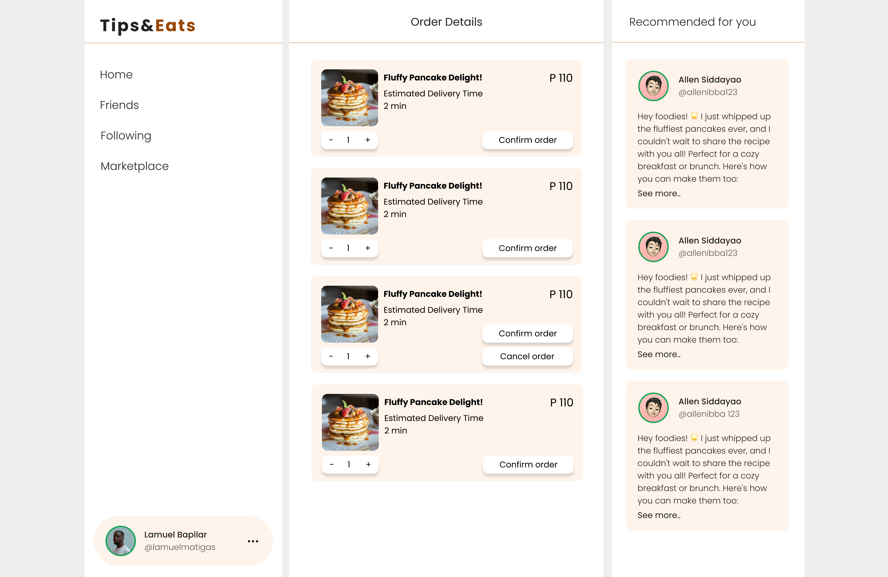
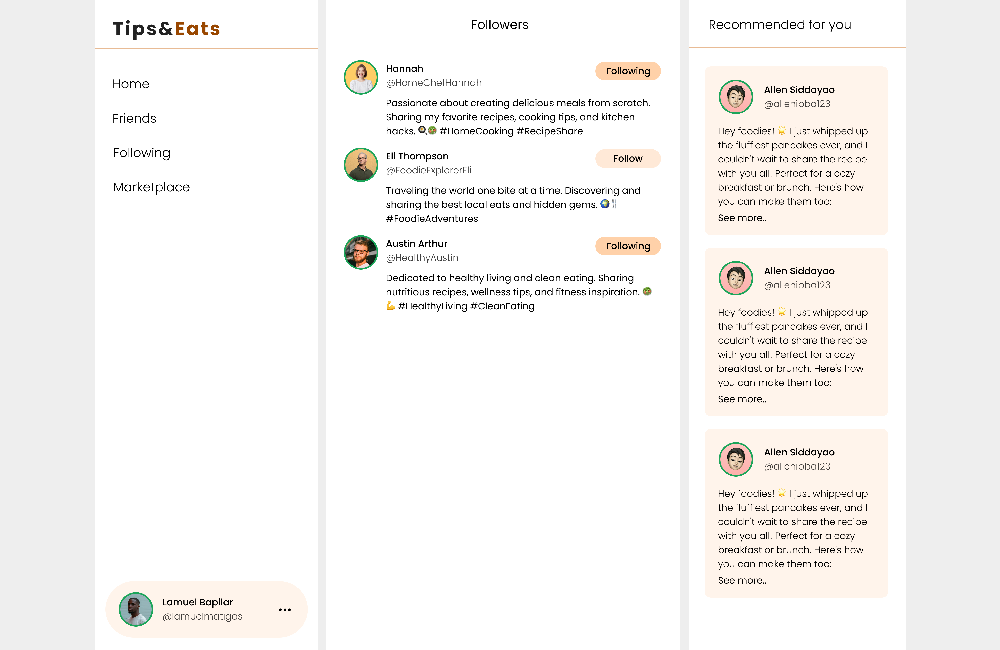
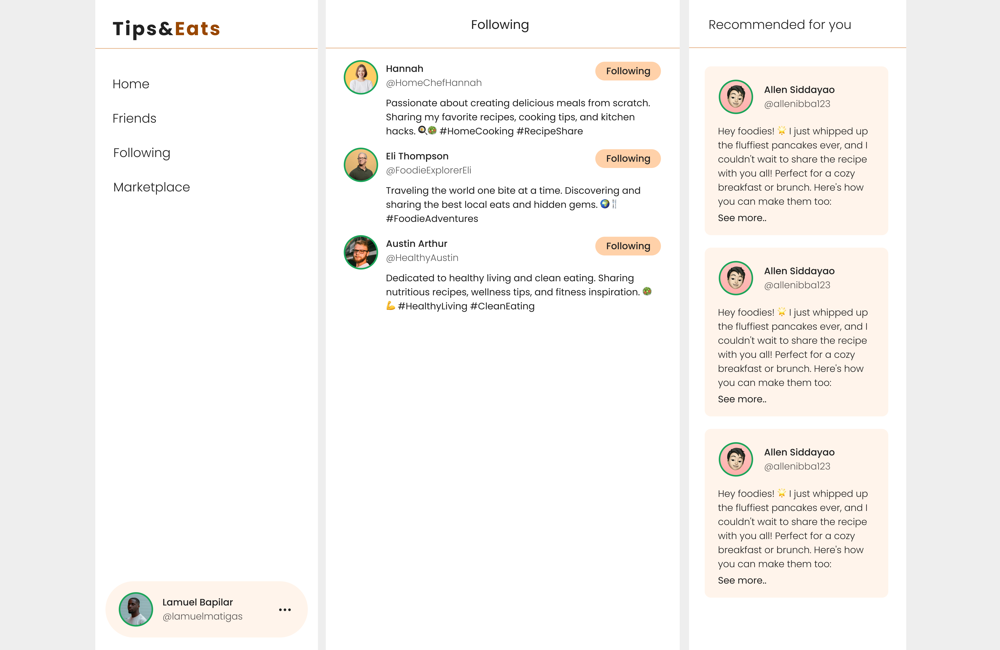

# 🍽️ Tips-Eats

A **web development project** designed to explore **UI/UX principles** in food-related applications.  
Tips-Eats focuses on creating a clean, intuitive interface for discovering, sharing, and managing food tips, recipes, and dining experiences.

---
## 📸 Screenshots





---

## ✨ Features
- 📖 **Recipe & Food Tips** – Share and browse curated cooking ideas and dining hacks.
- 🎨 **UI/UX-Centered Design** – Minimalist layouts, responsive components, and accessible typography.
- ⚡ **Vue.js Frontend** – Built with scalable component architecture for maintainability.
- 🔧 **Developer-Friendly Workflow** – Optimized with modern bundling tools (Vite/Webpack) and reproducible environments.

---

## 🛠️ Tech Stack
- **Frontend:** Vue.js 3, HTML5, CSS3
- **Bundler:** Vite (default) / Webpack (optional)
- **Version Control:** Git + GitHub
- **Deployment:** Static hosting (Netlify, Vercel, or GitHub Pages)

---

## 🚀 Getting Started

### 1. Clone the Repository
```bash
git clone https://github.com/ris0u/Tips-Eats.git
cd Tips-Eats
